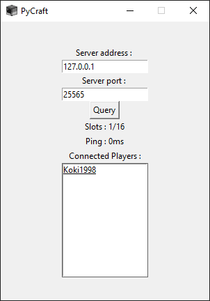

<h1>PyCraft</h1>
Lightweight Minecraft server querrier GUI made using Python.
 
<ul>
  <li>List of connected players on the server</li>
  <li>Slots indicator</li>
  <li>Latency indicator </li>
 </ul>
 

  

This project requires the <b>mcstatus</b> library : https://github.com/Dinnerbone/mcstatus
 Don't forget to enable the querry option in your server's 'server.property' file.
